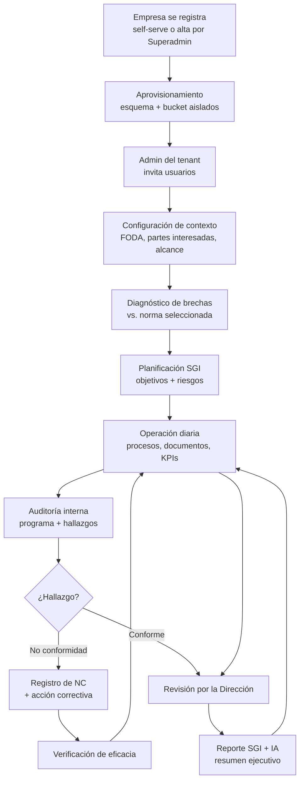
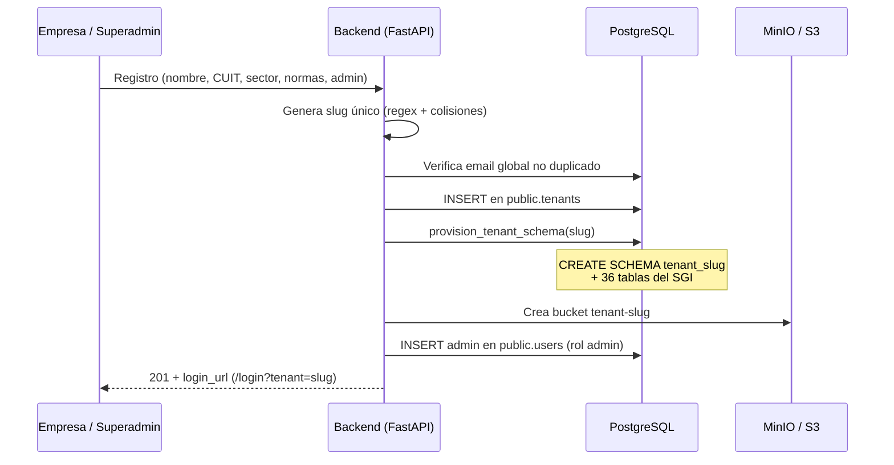
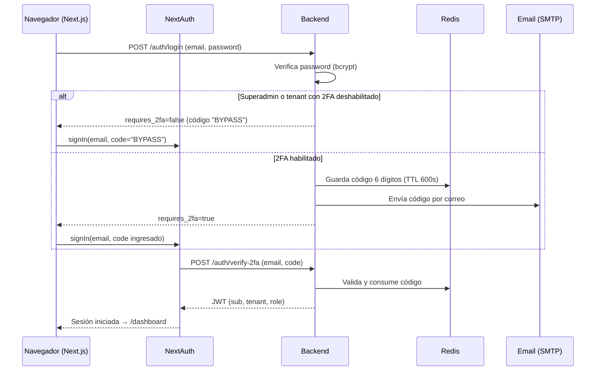
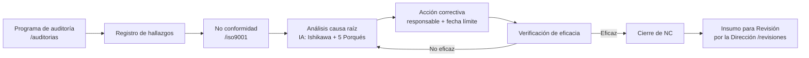
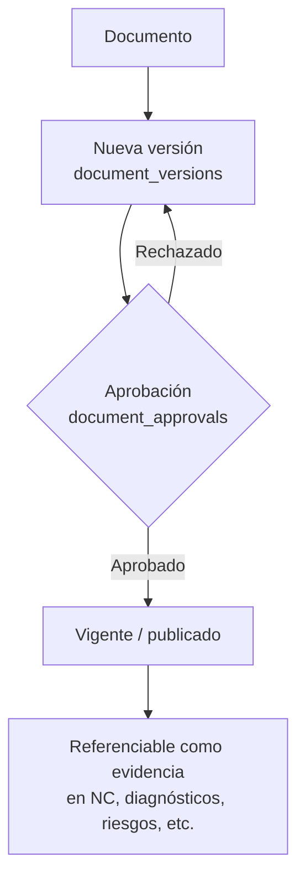
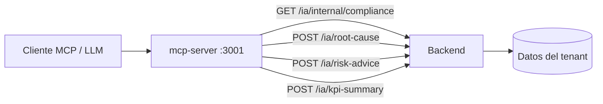
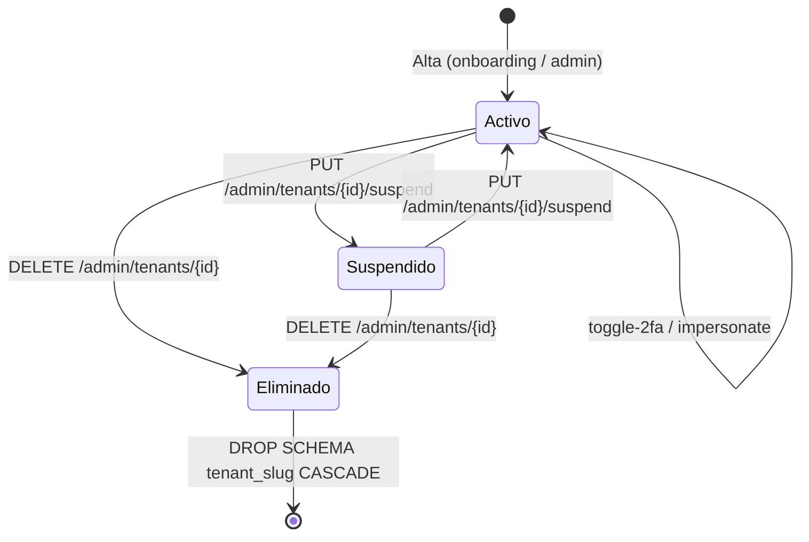

# Flujo de Negocio — AuditoríasEnLínea (SGNA)

> Plataforma SaaS **multi-tenant** para la gestión de Sistemas de Gestión Integrados (SGI)
> bajo normas ISO 9001 / 14001 / 45001 / 27001, con cálculo de huella de carbono y
> asistentes de IA (MCP). Este documento describe **qué hace el producto** y **cómo fluye
> la operación de negocio** de punta a punta.

---

## 1. Propuesta de valor

AuditoríasEnLínea permite a una organización digitalizar todo su Sistema de Gestión de
Calidad y Ambiente:

- **Diagnóstico de brechas (GAP analysis)** contra los requisitos de la norma.
- **Ciclo completo de auditoría interna** → hallazgos → no conformidades → acciones correctivas.
- **Gestión documental controlada (DMS)** con versionado y aprobaciones.
- **Huella de carbono** (Alcance 1, 2 y 3 — GHG Protocol).
- **Asistentes de IA** conectables vía MCP (consultor ISO, causa raíz, mitigación de riesgos, resumen ejecutivo de KPIs).

Cada empresa cliente es un **tenant** con datos totalmente aislados (esquema de base de
datos y bucket de objetos propios).

---

## 2. Actores y roles

| Rol | Ámbito | Capacidades principales |
|-----|--------|-------------------------|
| **Superadmin** | Global (toda la plataforma) | Alta/baja/suspensión de tenants, activar/desactivar 2FA por tenant, impersonar, métricas globales. Cuenta semilla: `gerencia@auditoriasenlinea.com.ar`. |
| **Admin (de tenant)** | Un tenant | Invitar/activar usuarios, configurar SMTP propio, activar/desactivar 2FA del tenant, operar todos los módulos SGI. |
| **Collaborator** | Un tenant | Operar los módulos SGI según su trabajo (rol por defecto de los usuarios invitados). |

El rol viaja dentro del JWT (`role`) y se valida en el backend:
`validate_superadmin` (consola global) y `validate_tenant_admin` (administración del tenant).

---

## 3. Mapa de módulos → cláusulas ISO

La navegación del dashboard expone los siguientes módulos de negocio:

| Módulo (UI) | Prefijo API | Foco normativo (ISO 9001) |
|-------------|-------------|----------------------------|
| Diagnóstico y Brechas | `/diagnosticos` | GAP analysis inicial |
| Contexto Organizacional | `/contexto` | Cl. 4 — FODA/PESTEL, partes interesadas, alcance, requisitos legales |
| Planificación SGI | `/planificacion` | Cl. 6 — objetivos, riesgos y oportunidades |
| Gestión de Procesos | `/procesos` | Cl. 4.4 — mapa de procesos (BPM) |
| Gestión Documental (DMS) | `/documents` | Cl. 7.5 — información documentada + versiones |
| Aprobaciones de Calidad | `/documents` (approvals) | Cl. 7.5 — control de aprobación documental |
| Auditorías Internas | `/auditorias` | Cl. 9.2 — programa y hallazgos |
| No Conformidades | `/iso9001` | Cl. 10.2 — NC y acciones correctivas |
| Control de Cambios | `/cambios` | Cl. 6.3 — gestión del cambio |
| Equipos y Calibración | `/equipos` | Cl. 7.1.5 — recursos de seguimiento y medición |
| Planes y Competencias | `/capacitaciones` | Cl. 7.2 — competencia y formación |
| Satisfacción de Clientes | `/satisfaccion` | Cl. 9.1.2 — encuestas |
| Gestión de Proveedores | `/proveedores` | Cl. 8.4 — evaluación y reclamos |
| Huella de Carbono | `/huella` | ISO 14064 / GHG Protocol |
| KPIs e Indicadores | `/kpis` | Cl. 9.1 — medición y análisis |
| Revisión por la Dirección | `/revisiones` | Cl. 9.3 |
| Reporte SGI | `/reportes` | Salidas consolidadas |
| Auditor de IA Hub | `/ia` | Asistentes MCP |
| Seguridad y Salud (SST) | `/sst` | ISO 45001 — incidentes e inspecciones |
| Mantenimiento (CMMS) | `/mantenimiento` | Cl. 7.1.3 — infraestructura / órdenes de trabajo |

---

## 4. Flujo maestro del negocio

---

## 5. Flujo: Alta de un nuevo cliente (onboarding)

Existen dos caminos de alta que terminan en el mismo aprovisionamiento:

- **Self-serve** (`POST /api/v1/onboarding/register`): la empresa se registra sola; plan `starter`.
- **Alta por Superadmin** (`POST /api/v1/admin/tenants`): plan `premium`.

> **Aislamiento de datos:** `public.tenants` y `public.users` son compartidos; **todos** los
> datos operativos del SGI viven en el esquema `tenant_{slug}`. En cada request autenticado
> el backend hace `SET search_path TO tenant_{slug}, public`.

---

## 6. Flujo: Inicio de sesión con 2FA

**Notas de negocio**
- La cuenta **Superadmin** siempre entra directo (bypass de 2FA).
- El Admin de cada tenant puede **activar/desactivar 2FA** para toda su organización.
- Si Redis no está disponible, el código 2FA usa un almacén en memoria de respaldo
  (válido solo mientras el proceso siga vivo) y **siempre** se registra en el log del contenedor
  como fallback de recuperación.

---

## 7. Flujo: Ciclo de auditoría y no conformidad (núcleo del SGI)

El módulo de **Diagnóstico y Brechas** (`diagnosticos` / `diagnostico_items`) permite
adjuntar evidencia documental (`evidencia_documento_id → documents.id`) a cada punto
evaluado de la norma.

---

## 8. Flujo: Gestión documental (DMS)

Los archivos binarios se guardan en el bucket **`tenant-{slug}`** (MinIO/S3); las descargas
se sirven mediante **URLs pre-firmadas temporales** (15 min por defecto).

---

## 9. Flujo: Asistentes de IA (MCP)

El `mcp-server` expone herramientas que consultan el backend (`/api/v1/ia/...`) y devuelven
análisis listos para un LLM:

| Herramienta MCP | Uso de negocio |
|-----------------|----------------|
| `calculate_emissions` | Cálculo de CO₂e por alcance/categoría |
| `check_compliance` | % de cumplimiento ISO 9001 desde el diagnóstico |
| `generate_root_cause` | Ishikawa + 5 Porqués para una NC |
| `risk_mitigation_advisor` | Mitigaciones según ISO 31000 |
| `kpi_executive_summary` | Resumen ejecutivo de KPIs del SGI |

> Todas las herramientas reciben `tenant_slug` para respetar el aislamiento por cliente.

---

## 10. Ciclo de vida de un tenant (visión Superadmin)

---

Para despliegue, configuración, respaldo y resolución de incidentes, ver
[`MANUAL_OPERACIONES.md`](./MANUAL_OPERACIONES.md).
