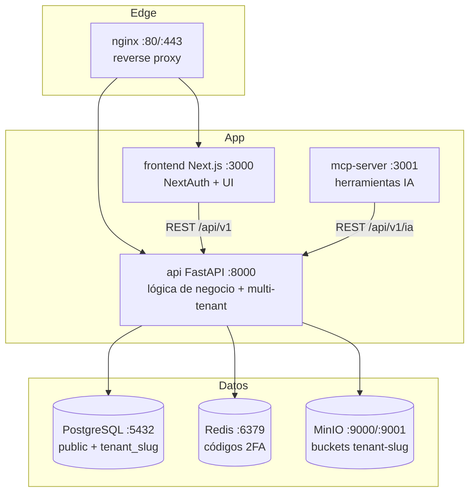
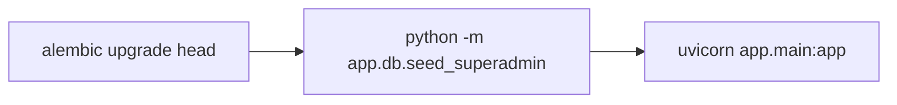

# Manual de Operaciones — AuditoríasEnLínea (SGNA)

> Guía operativa para desplegar, configurar, mantener y diagnosticar la plataforma.
> Para el contexto funcional ver [`FLUJO_DE_NEGOCIO.md`](./FLUJO_DE_NEGOCIO.md).

---

## 1. Arquitectura de la plataforma



**Componentes** (ver `docker-compose.yml`):

| Servicio | Imagen | Puerto | Rol |
|----------|--------|--------|-----|
| `nginx` | `nginx:alpine` | 80/443 | Reverse proxy / TLS |
| `frontend` | `ghcr.io/pel-matiasvaldivia/sgna/frontend` | 3000 | UI + sesión (NextAuth) |
| `api` | `ghcr.io/pel-matiasvaldivia/sgna/backend` | 8000 | API REST FastAPI |
| `mcp-server` | `ghcr.io/pel-matiasvaldivia/sgna/mcp-server` | 3001 | Herramientas IA (MCP) |
| `postgres` | `postgres:16-alpine` | 5432 | Base de datos multi-tenant |
| `redis` | `redis:7-alpine` | 6379 | Almacén de códigos 2FA |
| `minio` | `minio/minio` | 9000/9001 | Almacenamiento de objetos |

**Stack:** Backend FastAPI + SQLAlchemy 2.0 + Alembic · Frontend Next.js 14 (App Router) +
NextAuth · MCP con `@modelcontextprotocol/sdk`.

---

## 2. Modelo de aislamiento multi-tenant

- **Esquema `public`**: tablas compartidas `tenants` y `users`.
- **Esquema `tenant_{slug}`**: las 36 tablas del SGI, una copia por cliente.
- En cada request autenticado, `get_tenant_db` ejecuta `SET search_path TO "tenant_{slug}", public`
  a partir del `tenant` que viaja en el JWT.
- **Objetos**: un bucket `tenant-{slug}` por cliente en MinIO/S3.
- El aprovisionamiento (`provision_tenant_schema`) crea el esquema, ejecuta
  `Base.metadata.create_all`, aplica migraciones dinámicas puntuales (columnas de
  `riesgos_oportunidades`) y asegura el bucket.

> ⚠️ Los modelos `User` y `Tenant` fijan `__table_args__ = {"schema": "public"}`, por lo que
> `create_all` los mantiene siempre en `public` aunque el `search_path` apunte al tenant.
> Solo las tablas del SGI (sin esquema explícito) se crean dentro de `tenant_{slug}`.

---

## 3. Variables de entorno

Copiar `.env.example` a `.env` y completar. Claves relevantes:

| Variable | Consumidor | Descripción |
|----------|-----------|-------------|
| `NEXTAUTH_URL` / `NEXTAUTH_SECRET` | frontend | Base y secreto de NextAuth |
| `API_URL` → `NEXT_PUBLIC_API_URL` | frontend | URL pública del backend |
| `JWT_SECRET` | api | Firma de los JWT (HS256) |
| `DB_USER` / `DB_PASSWORD` / `DB_NAME` | postgres/api | Credenciales de la base |
| `REDIS_PASSWORD` | redis/api | Password de Redis (obligatorio, ver §7) |
| `MINIO_ROOT_USER` / `MINIO_ROOT_PASSWORD` | minio/api | Credenciales de objetos |
| `SMTP_HOST/PORT/USER/PASS` · `FROM_EMAIL` | api | Envío de correos 2FA/invitaciones |
| `ANTHROPIC_API_KEY` → `MCP_CLAUDE_API_KEY` | mcp/api | Clave del proveedor de IA |

**Mapeo de nombres (importante):** el backend (`app/core/config.py`) lee
`MINIO_ENDPOINT`, `MINIO_ACCESS_KEY`, `MINIO_SECRET_KEY` y `REDIS_URL`. En
`docker-compose.yml` estas se derivan de las variables de `.env`:

```yaml
- REDIS_URL=redis://:${REDIS_PASSWORD}@redis:6379/0
- MINIO_ENDPOINT=http://minio:9000
- MINIO_ACCESS_KEY=${MINIO_ROOT_USER}
- MINIO_SECRET_KEY=${MINIO_ROOT_PASSWORD}
```

> Si se renombran estas variables sin respetar los nombres que espera `Settings`
> (`case_sensitive=True`, `extra='ignore'`), la app usa **defaults** (`localhost:9000`) y las
> subidas a MinIO fallan silenciosamente.

---

## 4. Despliegue

### 4.1 Con Docker Compose (recomendado)

```bash
cp .env.example .env      # y completar valores reales
docker compose pull       # imágenes desde ghcr.io
docker compose up -d
docker compose ps         # verificar salud
```

Orden de arranque garantizado por `depends_on` + healthchecks: `postgres`/`redis`/`minio`
→ `api` → `frontend`/`mcp-server` → `nginx`.

### 4.2 Secuencia de arranque del backend

El contenedor `api` ejecuta en su `CMD`:



1. **`alembic upgrade head`** — aplica migraciones (crea columnas SMTP/límites y
   `two_factor_enabled` en `public.tenants`).
2. **`seed_superadmin`** — crea/actualiza el usuario `gerencia@auditoriasenlinea.com.ar`
   y garantiza la columna `two_factor_enabled` (idempotente).
3. **`uvicorn`** — levanta la API.

> Las tablas base `public.tenants`/`public.users` se crean en el **primer arranque de
> PostgreSQL** vía `db/init/00_create_base_schema.sql` (montado en
> `/docker-entrypoint-initdb.d`). Ese script solo corre con el volumen de datos vacío.

### 4.3 Build local de imágenes

```bash
docker build -t sgna/backend  ./backend
docker build -t sgna/frontend ./frontend
docker build -t sgna/mcp      ./mcp-server
```

El workflow `.github/workflows/docker-build.yml` publica las imágenes en GHCR.

---

## 5. Operación de la base de datos

### 5.1 Migraciones (Alembic)

```bash
# dentro del contenedor api (o con DATABASE_URL exportada)
alembic upgrade head              # aplicar
alembic downgrade -1              # revertir la última
alembic revision -m "descripcion" # nueva migración
alembic current                   # revisión aplicada
```

`alembic/env.py` toma la URL de `settings.DATABASE_URL` (ignora la de `alembic.ini`).

### 5.2 Respaldo y restauración

```bash
# Backup completo (todos los esquemas: public + tenant_*)
docker compose exec postgres pg_dump -U "$DB_USER" "$DB_NAME" > backup_$(date +%F).sql

# Backup de un tenant puntual
docker compose exec postgres pg_dump -U "$DB_USER" -n "tenant_<slug>" "$DB_NAME" > tenant_slug.sql

# Restore
cat backup.sql | docker compose exec -T postgres psql -U "$DB_USER" "$DB_NAME"
```

MinIO: respaldar el volumen `minio_data` o usar `mc mirror` sobre los buckets `tenant-*`.

### 5.3 Inspección rápida

```bash
# Listar esquemas de tenants
docker compose exec postgres psql -U "$DB_USER" "$DB_NAME" -c "\dn"
# Contar tablas por esquema
docker compose exec postgres psql -U "$DB_USER" "$DB_NAME" \
  -c "SELECT table_schema, count(*) FROM information_schema.tables GROUP BY 1;"
```

---

## 6. Administración operativa (Superadmin)

Endpoints bajo `/api/v1/admin` (requieren rol `superadmin`):

| Acción | Endpoint |
|--------|----------|
| Alta de tenant | `POST /admin/tenants` |
| Listar tenants | `GET /admin/tenants` |
| Activar/desactivar 2FA | `PUT /admin/tenants/{id}/toggle-2fa` |
| Suspender/reactivar | `PUT /admin/tenants/{id}/suspend` |
| Eliminar (drop schema) | `DELETE /admin/tenants/{id}` |
| Métricas globales | `GET /admin/metrics` |

Administración por tenant (`/api/v1/tenant`, rol `admin`): configurar SMTP, invitar usuarios
(`POST /tenant/users/invite`, genera password temporal), activar/desactivar usuarios.

Documentación interactiva de la API: **`/api/v1/docs`** (Swagger) y **`/api/v1/redoc`**.
Health check: **`GET /health`**.

---

## 7. Resolución de incidentes

| Síntoma | Causa probable | Acción |
|---------|----------------|--------|
| Todo request de tenant devuelve 500 al aprovisionar | FK inválida en un modelo hace fallar `create_all` | Revisar que todos los `ForeignKey` apunten a tablas existentes (`documents`, no `documentos`). Reproducir con `provision_tenant_schema` en un Postgres de prueba. |
| Subidas de archivos fallan / `localhost:9000` | Nombres de env S3 no coinciden con `MINIO_*` | Usar `MINIO_ENDPOINT/ACCESS_KEY/SECRET_KEY` (ver §3). |
| 2FA no persiste entre instancias | Redis sin autenticar → cae al store en memoria | Incluir password en `REDIS_URL`: `redis://:PASS@redis:6379/0`. |
| Login 500 "column two_factor_enabled does not exist" | Migración no aplicada / seed no corrió | Verificar que el `CMD` ejecute `alembic upgrade head` y `seed_superadmin`. |
| No existe usuario para entrar en un deploy nuevo | Seed no ejecutado | Correr `python -m app.db.seed_superadmin`. |
| No se puede leer el código 2FA en pruebas | — | El código **siempre** se imprime en el log del contenedor `api`. |

Comandos útiles:

```bash
docker compose logs -f api           # ver códigos 2FA / errores
docker compose exec redis redis-cli -a "$REDIS_PASSWORD" ping
curl -f http://localhost:8000/health
```

---

## 8. Seguridad — notas y backlog

Puntos vigentes a endurecer antes de producción real:

- **CORS abierto**: `app/main.py` usa `allow_origins=["*"]` con `allow_credentials=True`
  (marcado con `# TODO`). Restringir a los orígenes del frontend.
- **Credenciales del Superadmin**: `seed_superadmin.py` fija email y password por defecto y
  los reescribe en cada arranque. Rotar el password y gestionarlo como secreto.
- **Bypass de 2FA**: el código constante `"BYPASS"` se genera tras validar la contraseña en
  `/auth/login`; evitar exponer `verify-2fa` a códigos constantes fuera de ese flujo.
- **`search_path` en pool**: el aislamiento por request se apoya en `SET search_path`; validar
  que no haya fugas entre conexiones reutilizadas bajo alta concurrencia.
- **Endpoint de impersonación** (`POST /admin/tenants/{id}/impersonate`): actualmente invoca
  `create_access_token(data=..., expires_delta=...)`, pero la firma real es
  `create_access_token(subject, tenant_slug, role, expires_delta)`. La llamada falla con
  `TypeError` → **el endpoint no funciona**. Corregir la invocación antes de usarlo.

---

## 9. Referencias del repositorio

```
backend/    API FastAPI (app/api, app/models, app/services, alembic)
frontend/   Next.js 14 (src/app dashboard + auth)
mcp-server/ Servidor MCP con herramientas de IA
db/init/    SQL de bootstrap del esquema público
nginx/      Configuración del reverse proxy
docker-compose.yml   Orquestación de todos los servicios
```
