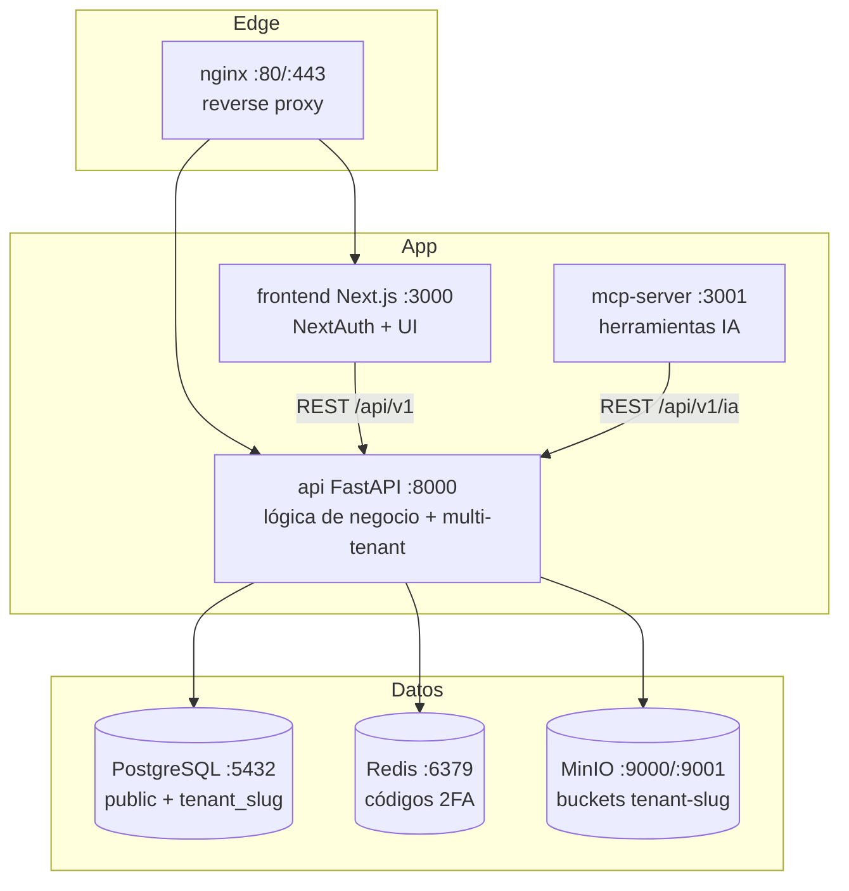
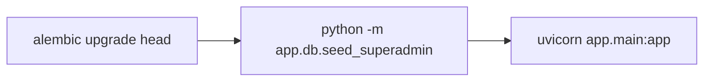

# Manual de Operaciones — AuditoríasEnLínea (SGNA)

> Guía operativa para desplegar, configurar, mantener y diagnosticar la plataforma.
> Para el contexto funcional ver [`FLUJO_DE_NEGOCIO.md`](./FLUJO_DE_NEGOCIO.md).

---

## 1. Arquitectura de la plataforma


```mermaid
flowchart TB
    subgraph Edge
        NG[nginx :80/:443<br/>reverse proxy]
    end
    subgraph App
        FE[frontend Next.js :3000<br/>NextAuth + UI]
        API[api FastAPI :8000<br/>lógica de negocio + multi-tenant]
        MCP[mcp-server :3001<br/>herramientas IA]
    end
    subgraph Datos
        PG[(PostgreSQL :5432<br/>public + tenant_slug)]
        RD[(Redis :6379<br/>códigos 2FA)]
        S3[(MinIO :9000/:9001<br/>buckets tenant-slug)]
    end

    NG --> FE
    NG --> API
    FE -->|REST /api/v1| API
    MCP -->|REST /api/v1/ia| API
    API --> PG
    API --> RD
    API --> S3
```

**Componentes** (ver `docker-compose.yml`):

| Servicio | Imagen | Puerto | Rol |
|----------|--------|--------|-----|
| `nginx` | `nginx:alpine` | 80/443 | Reverse proxy / TLS |
| `frontend` | `ghcr.io/pel-matiasvaldivia/sgna/frontend` | 3000 | UI + sesión (NextAuth) |
| `api` | `ghcr.io/pel-matiasvaldivia/sgna/backend` | 8000 | API REST FastAPI |
| `mcp-server` | `ghcr.io/pel-matiasvaldivia/sgna/mcp-server` | 3001 | Herramientas IA (MCP) |
| `postgres` | `postgres:16-alpine` | 5432 | Base de datos multi-tenant |
| `redis` | `redis:7-alpine` | 6379 | Almacén de códigos 2FA |
| `minio` | `${MINIO_IMAGE}` (espejo en GHCR) | 9000/9001 | Almacenamiento de objetos |

**Stack:** Backend FastAPI + SQLAlchemy 2.0 + Alembic · Frontend Next.js 15 (App Router) +
React 19 + NextAuth · MCP con `@modelcontextprotocol/sdk`.

> **MinIO ya no se baja de Docker Hub.** `minio/minio` pasó a exigir autenticación —todos sus
> tags responden 401, incluso releases fijos—, así que un `docker compose pull` contra Docker
> Hub falla y un host nuevo no puede levantar el stack. La imagen se replica en GHCR con
> `scripts/espejar-minio.sh`, que además escribe `MINIO_IMAGE` en el `.env`. Se pinnea a un
> **release concreto** a propósito: `latest` en un almacén de objetos significa que un
> reinicio puede cambiar la versión debajo de los datos.

> **nginx no sólo enruta.** También resuelve la IP real del cliente y la reenvía saneada al
> backend; esa IP queda en la constancia de aprobación de documentos. Ver §5.4.

---

## 2. Modelo de aislamiento multi-tenant

- **Esquema `public`**: tablas compartidas `tenants`, `users` y `user_tenants`
  (pertenencias; ver §2.1).
- **Esquema `tenant_{slug}`**: las 42 tablas del SGI, una copia por cliente.
- En cada request autenticado, `get_tenant_db` ejecuta `SET search_path TO "tenant_{slug}", public`
  a partir del `tenant` que viaja en el JWT.
- **Objetos**: un bucket `tenant-{slug}` por cliente en MinIO/S3.
- El aprovisionamiento (`provision_tenant_schema`) crea el esquema, ejecuta
  `Base.metadata.create_all`, aplica migraciones dinámicas puntuales (columnas de
  `riesgos_oportunidades`, `auditorias_asignaciones`, `respuestas_control`,
  `programas_auditoria.norma` y `puntos_control.modulo` / `evidencia_solicitada`) y
  asegura el bucket.

> ⚠️ `create_all` crea las **tablas** que faltan, pero **no agrega columnas** a una tabla que
> ya existe. Por eso cada columna nueva sobre una tabla de tenant necesita además una
> migración que recorra los esquemas `tenant_%` uno por uno (ver §6.1); con el `create_all`
> solo, los clientes existentes se quedan sin ella y el endpoint que la usa falla.

> ⚠️ Los modelos `User` y `Tenant` fijan `__table_args__ = {"schema": "public"}`, por lo que
> `create_all` los mantiene siempre en `public` aunque el `search_path` apunte al tenant.
> Solo las tablas del SGI (sin esquema explícito) se crean dentro de `tenant_{slug}`.

### 2.1 Una persona en varias organizaciones

La identidad y la pertenencia están separadas. `public.users` guarda la **cuenta** (email
único en toda la plataforma, contraseña, 2FA) y `public.user_tenants` guarda a qué
organizaciones pertenece y **con qué rol en cada una**.

Esto existe porque un auditor externo o un partner trabaja para varios clientes. Antes, el
email era único y pertenecía a un solo tenant: invitar a alguien ya registrado en otra
organización fallaba, y la única salida era inventarle un segundo correo.

Operativamente:

- Invitar (`POST /tenant/users/invite`) a un email **ya registrado** no crea otra cuenta:
  le agrega una pertenencia a esta organización. La persona entra con su contraseña de
  siempre.
- El rol efectivo sale de la pertenencia, no de `users.role`: la misma persona puede ser
  `admin` en una organización y auditor de campo en otra.
- En cada request, `get_current_active_user` resuelve el tenant del JWT y **exige** una
  pertenencia activa; sin ella responde 403 aunque el token sea válido. Es la barrera que
  impide que el token de una organización alcance los datos de otra.
- Dar de baja a alguien de una organización desactiva su pertenencia, no su cuenta: sigue
  trabajando en las demás.
- Al eliminar un tenant se borran sus pertenencias. Se eliminan además las cuentas
  **originadas en ese tenant** (`users.tenant_id`) que quedaron sin ninguna pertenencia; a
  quien además trabaja en otra organización se le quita el acceso a ésta, pero la cuenta
  sigue viva.

La lógica vive en `backend/app/core/membership.py` y está cubierta por
`backend/tests/test_membresias.py` y `test_membresias_api.py`.

---

## 3. Variables de entorno

Copiar `.env.example` a `.env` y completar. Claves relevantes:

| Variable | Consumidor | Descripción |
|----------|-----------|-------------|
| `NEXTAUTH_URL` / `NEXTAUTH_SECRET` | frontend | Base y secreto de NextAuth |
| `API_URL` → `NEXT_PUBLIC_API_URL` | frontend | URL pública del backend |
| `JWT_SECRET` | api | Firma de los JWT (HS256) |
| `DB_USER` / `DB_PASSWORD` / `DB_NAME` | postgres/api | Credenciales de la base |
| `REDIS_PASSWORD` | redis/api | Password de Redis (obligatorio, ver §8) |
| `MINIO_IMAGE` | compose | **Obligatoria.** Imagen espejada de MinIO; sin ella el stack no levanta (ver §1 y §5.1) |
| `MINIO_ROOT_USER` / `MINIO_ROOT_PASSWORD` | minio/api | Credenciales de objetos |
| `SMTP_HOST/PORT/USER/PASS` · `FROM_EMAIL` | api | Servidor SMTP y remitente de 2FA/comercial (ver §4) |
| `NOTIFICATIONS_FROM_EMAIL` · `NOTIFICATIONS_ENABLED` | api | Remitente y switch de las notificaciones del sistema (ver §4) |
| `APP_BASE_URL` | api | URL pública usada en los enlaces de los correos |
| `PASSWORD_RESET_TTL_MINUTES` · `PASSWORD_RESET_THROTTLE_SECONDS` | api | Vigencia del enlace de recuperación de contraseña y espera mínima entre dos pedidos (ver §4.5) |
| `LOG_LEVEL` | api | Nivel del log de la aplicación (`INFO` por defecto, ver §8) |
| `NOTIF_*_DIAS` · `SCHEDULER_ENABLED` · `NOTIF_HORA_UTC` · `CRON_SECRET` | api | Barrido preventivo "por vencer" (ver §4) |
| `TRANSCRIPTION_*` | api | Transcripción de notas de voz del auditor en campo (ver §4.4) |
| `ANTHROPIC_API_KEY` → `MCP_CLAUDE_API_KEY` | mcp/api | Clave del proveedor de IA |
| `NEXT_PUBLIC_HIDE_PRICES` | frontend | Oculta los precios del landing (`false` por defecto) |

**Mapeo de nombres (importante):** el backend (`app/core/config.py`) lee
`MINIO_ENDPOINT`, `MINIO_ACCESS_KEY`, `MINIO_SECRET_KEY` y `REDIS_URL`. En
`docker-compose.yml` estas se derivan de las variables de `.env`:

```yaml
- REDIS_URL=redis://:${REDIS_PASSWORD}@redis:6379/0
- MINIO_ENDPOINT=http://minio:9000
- MINIO_ACCESS_KEY=${MINIO_ROOT_USER}
- MINIO_SECRET_KEY=${MINIO_ROOT_PASSWORD}
```

> Si se renombran estas variables sin respetar los nombres que espera `Settings`
> (`case_sensitive=True`, `extra='ignore'`), la app usa **defaults** (`localhost:9000`) y las
> subidas a MinIO fallan silenciosamente.

---

## 4. Configuración de correo y notificaciones

La plataforma usa el correo para tres propósitos, **todos sobre la misma
configuración SMTP** (`app/services/email_service.py`):

| Propósito | Remitente | Variable |
|-----------|-----------|----------|
| Código 2FA de login | `FROM_EMAIL` | `FROM_EMAIL` |
| Avisos comerciales (demos) | `FROM_EMAIL` / `SALES_EMAIL` | `SALES_EMAIL` |
| **Notificaciones del sistema** | **`notificaciones@auditoriasenlinea.com.ar`** | `NOTIFICATIONS_FROM_EMAIL` |

### 4.1 SMTP base

```bash
SMTP_HOST=smtp.resend.com      # host del proveedor (Resend, SES, etc.)
SMTP_PORT=587                  # 587 = STARTTLS · 465 = SSL
SMTP_USER=resend               # usuario / API user
SMTP_PASS=***                  # password / API key
FROM_EMAIL=noreply@auditoriasenlinea.com.ar
```

> **Verificación de dominio.** Los remitentes (`FROM_EMAIL` y
> `NOTIFICATIONS_FROM_EMAIL`) deben estar verificados en el proveedor SMTP y el
> dominio debe tener **SPF, DKIM y DMARC** configurados; de lo contrario los
> correos caen en spam o son rechazados.

Podés probar la configuración SMTP de un tenant desde
`POST /api/v1/tenant/smtp/test`, que hace una conexión + login + envío real y
devuelve un diagnóstico legible (nunca lanza 500).

> Si `SMTP_HOST` queda vacío, **no se envía ningún correo**: el contenido completo
> se registra en el log del contenedor `api` (fallback para desarrollo).

### 4.2 Notificaciones del sistema

Todas salen desde `NOTIFICATIONS_FROM_EMAIL` y se agrupan en dos familias
(detalle funcional en [`backend/NOTIFICACIONES.md`](../backend/NOTIFICACIONES.md)).

**Inmediatas** — se disparan en el momento de la acción:

| Evento | Endpoint | Destinatario |
|--------|----------|--------------|
| Alta de tenant | `POST /onboarding/register`, `POST /admin/tenants` | Administrador del tenant |
| Invitación de miembro | `POST /tenant/users/invite` | Usuario invitado (con contraseña temporal) |
| Auditoría planificada | `POST /auditorias/programas` | Responsables de Calidad/SGI (admins) |
| Auditoría asignada | `POST /auditorias/asignaciones` | Auditor de campo |
| Solicitud de checklist | `POST /auditorias/asignaciones/{id}/solicitar-checklist` | Administradores del tenant |
| Enlace de recuperación de contraseña | `POST /auth/recuperar-password` | La cuenta que lo pidió (ver §4.5) |
| Aviso de contraseña cambiada | `POST /auth/restablecer-password` | La cuenta afectada (ver §4.5) |

El correo de **auditoría asignada** lleva lo que el auditor necesita para
llegar: organización, domicilio con enlace al mapa, horario, referente en sitio
(con el teléfono como enlace `tel:`) y alcance. Esos datos salen de la ficha de
la organización (`public.tenants.domicilio`, `telefono`, `contacto_*`) o de la
asignación cuando la auditoría se hace en otra sede. **Si la organización no
tiene domicilio cargado, el correo sale sin él** y el auditor no sabe a dónde
ir: completarlo en *Configuración → Organización* es parte del alta de cada
tenant.

**Preventivas ("por vencer")** — un barrido diario recorre todos los tenants
activos y envía a cada responsable un resumen de lo que requiere atención:

| Evento | Fuente | Umbral (días) |
|--------|--------|---------------|
| Calibración por vencer | `equipos_medicion.fecha_proxima_calibracion` | `NOTIF_CALIBRACION_DIAS` (15) |
| Mantenimiento programado | `cmms_ordenes_trabajo.fecha_programada` | `NOTIF_MANTENIMIENTO_DIAS` (7) |
| Acción/objetivo con fecha límite | `objetivos_sgi.fecha_limite` | `NOTIF_APROBACION_DIAS` (3) |

Variables de control:

```bash
NOTIFICATIONS_FROM_EMAIL=notificaciones@auditoriasenlinea.com.ar
NOTIFICATIONS_ENABLED=true                 # false = apaga todos los avisos
APP_BASE_URL=https://sgna.auditoriasenlinea.com.ar   # enlaces de los correos
NOTIF_CALIBRACION_DIAS=15
NOTIF_MANTENIMIENTO_DIAS=7
NOTIF_APROBACION_DIAS=3
```

### 4.3 Ejecución del barrido preventivo

Dos disparadores (podés usar uno o ambos):

1. **Scheduler interno (APScheduler).** Arranca junto con la API (evento
   `startup` en `app/main.py`) y corre todos los días a las `NOTIF_HORA_UTC:00`
   UTC. Se controla con `SCHEDULER_ENABLED`. Si APScheduler no está instalado,
   la app arranca igual y solo queda disponible el disparo externo.

   ```bash
   SCHEDULER_ENABLED=true
   NOTIF_HORA_UTC=10        # 10:00 UTC ≈ 07:00 America/Argentina
   ```

2. **Endpoint externo.** Para dispararlo desde un cron del sistema, n8n o un
   uptime-monitor. Protegido por el header `X-Cron-Secret`, que debe coincidir
   con `CRON_SECRET`. Si `CRON_SECRET` queda vacío, el endpoint responde 503.

   ```bash
   curl -X POST https://sgna.auditoriasenlinea.com.ar/api/v1/cron/notificaciones \
        -H "X-Cron-Secret: $CRON_SECRET"
   ```

   Devuelve un resumen JSON: tenants procesados, avisos por categoría, equipos
   marcados como `vencido` y emails enviados.

> El barrido es **multiempresa**: itera por el `search_path` de cada esquema
> `tenant_{slug}` respetando el aislamiento de datos, y marca automáticamente
> como `vencido` los equipos cuya calibración ya pasó.

### 4.4 Transcripción de notas de voz (Auditor en Campo)

**Doble llave: plataforma + cliente.** El checklist funciona siempre con **nota
escrita + foto** (modo por defecto, no configurable). La nota de voz es una
opción que se activa en dos niveles independientes:

| Nivel | Quién | Dónde | Efecto si está apagado |
|-------|-------|-------|------------------------|
| Plataforma | Operaciones | `TRANSCRIPTION_PROVIDER` / clave de API | El audio se guarda como evidencia pero no se convierte a texto |
| Cliente (tenant) | Admin del tenant | Configuración → Auditoría en Campo | El grabador ni siquiera aparece en la app |

El toggle del cliente se guarda en `tenant.settings["field_audit"]` y **exige
aceptar el aviso de privacidad** (`PUT /tenant/preferencias-campo` responde 400
sin `acepta_politica_privacidad`). Queda registrado quién aceptó y cuándo. Con
el toggle apagado, `POST /auditorias/puntos/{id}/audio` responde **403**: el
bloqueo es real, no solo de interfaz.

Estado combinado: `GET /auditorias/transcripcion/estado` devuelve `habilitada`
(plataforma), `habilitada_en_tenant` (cliente) y `operativa` (ambas).

Con las notas de voz activadas, el flujo es:

1. La app graba el audio (o el auditor sube un archivo) y lo encola en el outbox
   offline junto con la respuesta.
2. Al sincronizar, el audio se sube al bucket aislado del tenant
   (`POST /auditorias/puntos/{id}/audio` → `auditorias/{punto_id}/audio/...`).
3. Al **firmar** la auditoría, el backend transcribe las notas de voz pendientes
   e incorpora el texto a la observación del punto (y a la No Conformidad si la
   generó). Se puede re-procesar con
   `POST /auditorias/asignaciones/{id}/transcribir`.

El proveedor es **enchufable** (`app/services/transcription.py`) y usa una API
compatible con `/v1/audio/transcriptions`. Viene **activado con OpenAI**; lo
único que hay que completar en el `.env` es la clave:

```bash
TRANSCRIPTION_PROVIDER=openai     # valor por defecto; "none" lo deshabilita
TRANSCRIPTION_API_KEY=sk-...      # OBLIGATORIA (también se acepta OPENAI_API_KEY)
TRANSCRIPTION_MODEL=whisper-1     # o gpt-4o-transcribe / gpt-4o-mini-transcribe
TRANSCRIPTION_API_URL=https://api.openai.com/v1/audio/transcriptions
TRANSCRIPTION_LANGUAGE=es
TRANSCRIPTION_MAX_MB=25
```

Verificación después de desplegar:

```bash
docker compose logs api | grep transcripcion
# [transcripcion] activa — proveedor=openai modelo=whisper-1 idioma=es
# [transcripcion] INACTIVA — Falta la clave de API (...)

# Con un token de usuario válido:
curl -H "Authorization: Bearer $TOKEN" \
     https://sgna.auditoriasenlinea.com.ar/api/v1/auditorias/transcripcion/estado
```

> Esta URL es **solo de diagnóstico**: devuelve el estado de la función. No es
> una API compatible con OpenAI, así que no sirve como *base URL* de un proveedor
> en el IA Hub (cargarla ahí genera 404 en `/models` y `/chat/completions`).

> **El audio nunca se pierde.** Si falta la clave o el proveedor falla, la nota
> de voz queda igualmente adjunta como evidencia en el bucket del tenant y la
> respuesta se marca con `transcripcion_estado = no_disponible | error`. La
> transcripción **nunca** bloquea el cierre de la auditoría; se puede reintentar
> con `POST /auditorias/asignaciones/{id}/transcribir`.

**Consideración de privacidad:** con esto activado, el audio grabado en planta
se envía a OpenAI para su conversión a texto. Cada cliente decide si lo usa y
debe aceptar el aviso de privacidad al activarlo (queda constancia en
`tenant.settings["field_audit"]`), pero eso no reemplaza dejarlo asentado en la
política de privacidad de la plataforma. Para desactivarlo en todo un despliegue,
`TRANSCRIPTION_PROVIDER=none`.

**Costo:** se factura por minuto de audio procesado contra la cuenta de OpenAI
dueña de la clave. Conviene poner un límite de gasto mensual en el panel de
OpenAI, ya que el volumen depende de cuánto dicten los auditores en campo.

### 4.5 Recuperación de contraseña

Antes, quien olvidaba la contraseña dependía de que un administrador se la
cambiara a mano. Para un auditor de campo parado en planta, eso es quedar
afuera del trabajo del día. Ahora el flujo es autoservicio:

```
/login → «¿Olvidaste tu contraseña?» → /recuperar  (POST /auth/recuperar-password)
   → correo con enlace → /restablecer?token=…      (GET/POST /auth/restablecer-password)
   → /login con la contraseña nueva
```

Decisiones que conviene conocer antes de tocar algo acá:

- **Depende del correo.** Si el SMTP está caído, el enlace no llega y la
  persona no puede entrar. El pedido queda registrado igual: buscar
  `NO se pudo enviar` en el log del contenedor `api` (ver §8).
- **La respuesta es siempre la misma**, exista o no la cuenta. Es deliberado:
  el formulario es público y, si distinguiera, serviría para averiguar qué
  correos están registrados en la plataforma. Por el mismo motivo, un SMTP
  caído tampoco se le informa a quien pide.
- **En la base sólo queda el SHA-256 del token** (`public.password_reset_tokens`),
  nunca el token. Un volcado de esa tabla no permite cambiarle la contraseña a
  nadie, y tampoco permite reconstruir los enlaces ya enviados.
- **Un solo uso y con vencimiento** (`PASSWORD_RESET_TTL_MINUTES`, 120 por
  defecto). Pedir un enlace nuevo invalida el anterior: vale siempre el último.
- **Espera entre pedidos** (`PASSWORD_RESET_THROTTLE_SECONDS`, 120 por defecto),
  para que el formulario no sirva para inundar la casilla de otra persona.
- **El cambio se avisa por correo** a la cuenta afectada. Si no fue ella, ese
  mensaje es su única señal para reaccionar.
- Una cuenta **desactivada no se puede recuperar**: no se le emite vale. La
  reactiva un administrador desde *Configuración → Usuarios*.
- El 2FA **no se saltea**: después de cambiar la contraseña, el ingreso sigue
  el camino normal de la organización.

Diagnóstico de un pedido puntual (nunca muestra el token, que no está guardado):

```sql
SELECT u.email, t.created_at, t.expires_at, t.used_at, t.ip_solicitud
  FROM public.password_reset_tokens t
  JOIN public.users u ON u.id = t.user_id
 ORDER BY t.created_at DESC LIMIT 10;
```

`used_at IS NULL` y `expires_at` en el futuro = el enlace sigue vigente. Si hay
muchas filas seguidas para una misma cuenta desde IPs distintas, es un barrido
contra la plataforma y no un olvido.

---

## 5. Despliegue

### 5.1 Con Docker Compose (recomendado)

```bash
cp .env.example .env      # y completar valores reales
./scripts/espejar-minio.sh   # espeja MinIO en GHCR y escribe MINIO_IMAGE en el .env
docker compose pull       # imágenes desde ghcr.io
docker compose up -d
docker compose ps         # verificar salud
```

> El paso del espejo se corre **una vez por release de MinIO**, no en cada despliegue.
> Necesita un PAT clásico con `write:packages`, y el paquete en GHCR debe quedar **público**
> para que el host de producción pueda bajarlo sin credenciales. Con `MINIO_IMAGE` vacía el
> stack falla con un mensaje que lo explica; con un valor inventado fallaría con un
> `manifest unknown` que no explica nada.

Orden de arranque garantizado por `depends_on` + healthchecks: `postgres`/`redis`/`minio`
→ `api` → `frontend`/`mcp-server` → `nginx`.

### 5.2 Secuencia de arranque del backend

El contenedor `api` ejecuta en su `CMD`:


```mermaid
flowchart LR
    A[alembic upgrade head] --> B[python -m app.db.seed_superadmin] --> C[uvicorn app.main:app]
```

1. **`alembic upgrade head`** — aplica migraciones (ver §6.1). **Si falla, la API no
   arranca**: el `&&` corta la cadena. Ante un contenedor que no levanta tras un `pull`,
   mirar primero `docker compose logs api`.
2. **`seed_superadmin`** — crea/actualiza el usuario `gerencia@auditoriasenlinea.com.ar`
   y garantiza la columna `two_factor_enabled` (idempotente).
3. **`uvicorn`** — levanta la API con `--proxy-headers` y `--forwarded-allow-ips` acotado
   a redes privadas (ver §5.4). En el evento `startup` arranca el **scheduler de
   notificaciones preventivas** si `SCHEDULER_ENABLED=true` (ver §4.3).

> Las tablas base `public.tenants`/`public.users` se crean en el **primer arranque de
> PostgreSQL** vía `db/init/00_create_base_schema.sql` (montado en
> `/docker-entrypoint-initdb.d`). Ese script solo corre con el volumen de datos vacío.

### 5.3 Build local de imágenes

```bash
docker build -t sgna/backend  ./backend
docker build -t sgna/frontend ./frontend
docker build -t sgna/mcp      ./mcp-server
```

El workflow `.github/workflows/docker-build.yml` publica las imágenes en GHCR.

### 5.4 IP real del cliente

La cadena es: **cliente → NPM** (Nginx Proxy Manager externo, termina TLS) **→ nginx del
stack → api**. Esa IP no es solo para los logs: queda guardada en
`document_approvals.ip_address` y se muestra en la constancia de aprobación, así que no
puede ser un dato que el firmante elija.

`X-Forwarded-For` se appendea en cada salto y **el primer eslabón lo escribe el navegador**.
Por eso:

1. **nginx no reenvía la cadena que recibe.** La reemplaza por un único valor que calcula a
   partir del `X-Real-IP` que escribe el proxy de entrada —NPM lo pisa, no lo appendea— y
   sólo si el peer llega por red privada. Un origen cualquiera que pegue directo contra el
   puerto publicado no puede cambiar su propia IP. La cadena original queda en el
   `access_log` para diagnóstico. Ver el bloque "IP real del cliente" en `nginx/nginx.conf`.
2. **uvicorn no confía en cualquiera.** `--forwarded-allow-ips` lista redes privadas, no `*`.
   Con `*`, uvicorn se queda con el primer eslabón —el que escribe el navegador— y la IP de
   la constancia pasa a ser falsificable. **Es el cambio más fácil de hacer sin querer y el
   más difícil de notar.**

Comprobación, sin necesidad de levantar el stack:

```bash
scripts/probar-ip-cliente.sh    # necesita nginx y python3, no necesita root
```

Levanta un nginx real con la configuración del repositorio y le pega con headers
falsificados. Si alguien vuelve a `$proxy_add_x_forwarded_for` o a `--forwarded-allow-ips='*'`,
también lo detecta `backend/tests/test_firma_aprobacion.py`, que lee el `Dockerfile` y los
`.conf` reales.

> **Si NPM pasa a correr en otra máquina con IP pública**, hay que agregar esa dirección al
> bloque `geo` de `nginx/nginx.conf`. Mientras no esté, la constancia registra la IP de NPM
> en lugar de la del usuario: un dato equivocado, pero nunca uno que el firmante pueda elegir.

> **Pendiente de confirmar en el despliegue real.** La cadena se probó con un nginx local,
> no contra el NPM de producción. Conviene aprobar un documento de prueba y comparar la IP
> de la constancia con la IP pública real de quien firmó:
>
> ```sql
> SELECT ip_address, user_agent, fecha_resolucion
>   FROM "tenant_<slug>".document_approvals
>  ORDER BY fecha_resolucion DESC LIMIT 1;
> ```
>
> Si aparece una dirección privada (la del contenedor de nginx o la de NPM), falta ajustar
> la cadena de proxies.

---

## 6. Operación de la base de datos

### 6.1 Migraciones (Alembic)

```bash
# dentro del contenedor api (o con DATABASE_URL exportada)
alembic upgrade head              # aplicar
alembic downgrade -1              # revertir la última
alembic revision -m "descripcion" # nueva migración
alembic current                   # revisión aplicada
alembic heads                     # cabezas de la cadena: tiene que haber UNA
```

`alembic/env.py` toma la URL de `settings.DATABASE_URL` (ignora la de `alembic.ini`).

**Migraciones vigentes** (cadena lineal; cada una encadena en la anterior):

| Revisión | Qué hace |
|----------|----------|
| `0001_add_smtp_limits` | Columnas SMTP, límites y `two_factor_enabled` en `public.tenants` |
| `0002_user_tenants` | Tabla `public.user_tenants` (pertenencias, §2.1) |
| `0003_approval_document_version` | `document_approvals.document_version` en cada esquema de tenant |
| `0004_plan_auditoria` | `planes_auditoria` y `planes_auditoria_correlativo` por tenant, más `programas_auditoria.norma` y `puntos_control.modulo` / `evidencia_solicitada` |
| `0005_recuperacion_password` | `public.password_reset_tokens` (vales de un solo uso del flujo «olvidé mi contraseña», §4.5) |
| `0006_ubicacion_auditoria` | Ficha de la organización en `public.tenants` (`domicilio`, `telefono`, `contacto_*`) y ubicación/horario/referente en `auditorias_asignaciones` de cada tenant |
| `0007_edicion_tenant` | `public.tenants.edicion` — edición contratada (§10). Nullable y sin default a propósito: NULL es «todavía no eligió» |
| `0008_empresas_auditadas` | `empresas_auditadas` y `auditorias_asignaciones.empresa_id` en el schema de cada tenant (§12). NULL = se audita la propia organización |
| `0009_clasificacion_hallazgos` | `respuestas_control.clasificacion` y `.hallazgo_id`, más `auditorias_hallazgos.origen` y `.asignacion_id`, en el schema de cada tenant (§13). NULL = sin calificar / cargado a mano |

> **Dos cabezas = la API no arranca.** Si dos ramas agregan una migración desde la misma
> revisión base, `alembic upgrade head` aborta y, como el `CMD` encadena con `&&`, el
> contenedor muere en el arranque. Antes de mergear una rama que trae migraciones, correr
> `alembic heads` sobre el resultado: tiene que devolver **una sola**. Si hay dos, se
> corrige apuntando el `down_revision` de la más nueva a la otra.

> **El orden importa más que el número.** Si la revisión A ya se aplicó en producción y
> después se integra una B que encadena *antes* de A, alembic ve la base al día y **nunca
> ejecuta B**: la columna no se crea y el endpoint que la usa falla. Al integrar ramas
> desfasadas, la migración que llega después tiene que encadenar **después** de la que ya
> está aplicada, aunque el número quede fuera de orden.

> **Las tablas y columnas de tenant se migran esquema por esquema.** `document_approvals`,
> `puntos_control` y compañía viven en `tenant_{slug}`, no en `public`, así que las
> migraciones recorren `information_schema.schemata` filtrando `tenant\_%`. Al escribir una
> nueva: `IF NOT EXISTS` en todo (tiene que poder reintentarse) y **nunca** meter el nombre
> del esquema dentro del nombre de un índice — un slug con guion (`olca-sa`) genera
> `ix_tenant_olca-sa_...` y Postgres lo rechaza por sintaxis.

### 6.2 Respaldo y restauración

```bash
# Backup completo (todos los esquemas: public + tenant_*)
docker compose exec postgres pg_dump -U "$DB_USER" "$DB_NAME" > backup_$(date +%F).sql

# Backup de un tenant puntual
docker compose exec postgres pg_dump -U "$DB_USER" -n "tenant_<slug>" "$DB_NAME" > tenant_slug.sql

# Restore
cat backup.sql | docker compose exec -T postgres psql -U "$DB_USER" "$DB_NAME"
```

MinIO: respaldar el volumen `minio_data` o usar `mc mirror` sobre los buckets `tenant-*`.

### 6.3 Inspección rápida

```bash
# Listar esquemas de tenants
docker compose exec postgres psql -U "$DB_USER" "$DB_NAME" -c "\dn"
# Contar tablas por esquema
docker compose exec postgres psql -U "$DB_USER" "$DB_NAME" \
  -c "SELECT table_schema, count(*) FROM information_schema.tables GROUP BY 1;"
```

---

## 7. Administración operativa (Superadmin)

Endpoints bajo `/api/v1/admin` (requieren rol `superadmin`):

| Acción | Endpoint |
|--------|----------|
| Alta de tenant | `POST /admin/tenants` |
| Listar tenants | `GET /admin/tenants` |
| Activar/desactivar 2FA | `PUT /admin/tenants/{id}/toggle-2fa` |
| Suspender/reactivar | `PUT /admin/tenants/{id}/suspend` |
| Eliminar (drop schema) | `DELETE /admin/tenants/{id}` |
| Métricas globales | `GET /admin/metrics` |

Administración por tenant (`/api/v1/tenant`, rol `admin`): configurar SMTP, invitar usuarios
(`POST /tenant/users/invite`, genera password temporal), activar/desactivar usuarios.

Documentación interactiva de la API: **`/api/v1/docs`** (Swagger) y **`/api/v1/redoc`**.
Health check: **`GET /health`**.

---

## 8. Resolución de incidentes

| Síntoma | Causa probable | Acción |
|---------|----------------|--------|
| Todo request de tenant devuelve 500 al aprovisionar | FK inválida en un modelo hace fallar `create_all` | Revisar que todos los `ForeignKey` apunten a tablas existentes (`documents`, no `documentos`). Reproducir con `provision_tenant_schema` en un Postgres de prueba. |
| Subidas de archivos fallan / `localhost:9000` | Nombres de env S3 no coinciden con `MINIO_*` | Usar `MINIO_ENDPOINT/ACCESS_KEY/SECRET_KEY` (ver §3). |
| 2FA no persiste entre instancias | Redis sin autenticar → cae al store en memoria | Incluir password en `REDIS_URL`: `redis://:PASS@redis:6379/0`. |
| Login 500 "column two_factor_enabled does not exist" | Migración no aplicada / seed no corrió | Verificar que el `CMD` ejecute `alembic upgrade head` y `seed_superadmin`. |
| No existe usuario para entrar en un deploy nuevo | Seed no ejecutado | Correr `python -m app.db.seed_superadmin`. |
| No se puede leer el código 2FA en pruebas | — | El código se registra en el log del contenedor `api` (`docker compose logs api`). **Requiere `LOG_LEVEL=INFO`** (el valor por defecto): hasta que `app/main.py` configuró el logging, uvicorn dejaba el logger raíz en `WARNING` y **nada de esto aparecía**. |
| Ningún correo llega (2FA ni notificaciones) | `SMTP_HOST` vacío o credenciales inválidas | El contenido queda en el log del `api` (ver la fila anterior). Revisar SMTP y probar con `POST /tenant/smtp/test` (ver §4). |
| Notificaciones no llegan pero el 2FA sí | Remitente `NOTIFICATIONS_FROM_EMAIL` no verificado, o `NOTIFICATIONS_ENABLED=false` | Verificar el remitente en el proveedor (SPF/DKIM/DMARC) y el switch (ver §4.2). |
| Los avisos "por vencer" no se envían | Scheduler apagado y sin cron externo | `SCHEDULER_ENABLED=true`, o disparar `POST /cron/notificaciones` con `X-Cron-Secret` (ver §4.3). |
| El auditor no ve una auditoría recién asignada | Vista cacheada en el dispositivo | Se revalida sola al volver a la app, al reconectar y cada 60 s; también hay botón "Actualizar". Si persiste, verificar que `GET /auditorias/asignaciones/mias` responda 200. |
| La auditoría abre sin preguntas | Fue asignada **sin plantilla** y el líder aún no las cargó | El líder las carga en "Asignaciones de Campo → Editar preguntas del checklist"; el auditor puede reclamarlas con "Solicitar checklist al líder". |
| Las notas de voz no se convierten en texto | `TRANSCRIPTION_PROVIDER=none` o la API rechazó el audio | Ver §4.4. El audio queda adjunto igual; re-procesar con `POST /auditorias/asignaciones/{id}/transcribir` y revisar `transcripcion_estado`. |
| El auditor no ve el grabador de voz en la app | El tenant no habilitó las notas de voz | Es el comportamiento por defecto. Un admin las activa en Configuración → Auditoría en Campo (requiere aceptar el aviso de privacidad). Verificar con `GET /auditorias/transcripcion/estado`. |
| `POST /puntos/{id}/audio` responde 403 | Notas de voz desactivadas para ese tenant | Mismo punto anterior: el bloqueo también se aplica en el servidor, no solo en la interfaz. |
| No se puede grabar audio en el celular | Permiso de micrófono denegado o sitio sin HTTPS | `getUserMedia` exige contexto seguro: servir por HTTPS y aceptar el permiso. Como alternativa, la app permite subir un archivo de audio. |
| 500 `duplicate key ... pg_namespace_nspname_index` al entrar a un tenant nuevo | Varias requests simultáneas provisionaban el schema a la vez: `CREATE SCHEMA IF NOT EXISTS` **no es atómico** en Postgres | Resuelto: la provisión toma un `pg_advisory_xact_lock` por schema y se cachea por proceso. Si reaparece, verificar que `provision_tenant_schema` no se haya modificado para saltear el lock. |
| 500 `relation "..." does not exist` en un POST que **igual creó la fila** | Se perdía el `search_path` después del `commit`: la conexión vuelve al pool y el `refresh` posterior podía tomar otra | Resuelto con el listener `after_begin` en `db/session.py`, que re-aplica el `search_path` en cada transacción. Toda sesión de tenant debe llevar `db.info["tenant_schema"]`. |
| 500 `InFailedSqlTransaction` con `[SQL: SET search_path TO public]` | Síntoma, no causa: el `finally` de la sesión escribía sobre una transacción ya abortada y tapaba el error real | Resuelto: el cierre ya no emite ese `SET`. Si aparece en un log viejo, el error verdadero está más arriba en el traceback. |
| 404 en `/auditorias/transcripcion/estado/models` y `/chat/completions` | La URL de verificación de §4.4 se cargó como *base URL* de un proveedor en el IA Hub | No es un fallo del backend: `…/transcripcion/estado` es un endpoint de diagnóstico, no una API estilo OpenAI. Corregir la base URL del proveedor en el IA Hub. |
| `docker compose pull` → `manifest unknown` en minio | `MINIO_IMAGE` apunta a un tag que no existe en el espejo | Correr `./scripts/espejar-minio.sh` y usar el valor que escribe en el `.env` (ver §5.1). Con la variable **vacía** el stack falla con un mensaje explícito; es preferible a un placeholder con pinta de tag real. |
| `docker compose pull` → 401 contra `minio/minio` | Se revirtió `MINIO_IMAGE` a la imagen de Docker Hub | Docker Hub exige autenticación para esa imagen. Usar el espejo de GHCR (§1). |
| El contenedor `api` muere al arrancar con `ModuleNotFoundError: No module named 'psycopg'` | SQLAlchemy 2.1 cambió el driver por defecto de `postgresql://` de psycopg2 a psycopg v3 | Resuelto: `app/core/config.py` reescribe la URL a `postgresql+psycopg2://`. Si reaparece, verificar que ese validador siga en pie y que `requirements.lock.txt` se esté usando en el build. |
| El contenedor `api` muere al arrancar con un error de alembic | Migración fallida, o **dos cabezas** en la cadena | `docker compose logs api`. Para dos cabezas ver §6.1; el `CMD` encadena con `&&`, así que cualquier fallo de `alembic upgrade head` impide que uvicorn levante. |
| `DuplicateTable` / `relation "user_tenants" already exists` al desplegar | La tabla estaba definida a la vez en `db/init/*.sql` y en una migración | Resuelto: vive sólo en la migración `0002`, y la migración es defensiva. No duplicar objetos entre el init SQL y alembic: el init solo corre con el volumen vacío, la migración corre siempre. |
| Al impersonar un tenant, el menú aparece vacío (solo "Mi Perfil") | La lista de roles con acceso total estaba duplicada entre backend y frontend y se desincronizó | Resuelto: `test_impersonacion.py` compara `FULL_ROLES` del backend con la copia de `frontend/src/app/dashboard/layout.tsx` y falla si divergen. |
| La constancia de aprobación muestra la IP de nginx o de NPM, no la del usuario | La cadena de proxies no está contemplada en el bloque `geo` | Ver §5.4. Verificar con `scripts/probar-ip-cliente.sh` y, si NPM llega desde una IP pública, agregarla al `geo`. |
| Un programa de auditoría no tiene plan | Fue creado antes de que existiera la función | No hay que hacer nada: `GET /auditorias/programas/{id}/plan` lo emite en el momento, con el código correlativo del año de ese programa. |
| El enlace de recuperación nunca llega | SMTP caído, o el pedido cayó en la espera entre pedidos | Buscar `NO se pudo enviar` en `docker compose logs api`. Si no aparece ese aviso ni el cuerpo del correo, el pedido fue descartado por el *throttle* (§4.5): esperar `PASSWORD_RESET_THROTTLE_SECONDS` y reintentar. |
| «El enlace no sirve» al abrir el correo | Ya se usó, venció, o se pidió otro después | Son las tres condiciones de §4.5; vale siempre el **último** enlace enviado. Pedir uno nuevo desde `/recuperar`. |
| El auditor no sabe a dónde ir / «Sin domicilio cargado» | La organización no tiene domicilio y la asignación tampoco | Cargarlo en *Configuración → Organización* (lo heredan todas las asignaciones que no traigan uno propio) o indicarlo al asignar. El listado del líder marca en ámbar las asignaciones sin domicilio. |
| El pin del mapa cae lejos del lugar real | El domicilio escrito es ambiguo para el buscador (obra sin numeración, galpón sobre ruta) | Probar el domicilio con «Comprobar que el mapa lo encuentra» en *Configuración → Organización*. Para el punto exacto, cargar `lugar_lat` / `lugar_lng` en la asignación: las coordenadas tienen prioridad sobre el texto. |
| El auditor de campo recibe 403 al cambiar algo de su auditoría | Intentó modificar la **planificación** (lugar, horario, contacto, fecha, área), no el estado | Es deliberado: eso lo acuerda el auditor líder con la organización. El auditor de campo sólo mueve `estado`. Si tiene que cambiarse, lo hace el líder desde «Asignaciones de Campo». |

Comandos útiles:

```bash
docker compose logs -f api           # ver códigos 2FA / errores / envío de correos
docker compose exec redis redis-cli -a "$REDIS_PASSWORD" ping
curl -f http://localhost:8000/health
# Forzar el barrido preventivo de notificaciones (si CRON_SECRET está configurado)
curl -X POST http://localhost:8000/api/v1/cron/notificaciones -H "X-Cron-Secret: $CRON_SECRET"
```

---

## 9. Seguridad — notas y backlog

Puntos vigentes a endurecer antes de producción real:

- **CORS abierto**: `app/main.py` usa `allow_origins=["*"]` con `allow_credentials=True`
  (marcado con `# TODO`). Restringir a los orígenes del frontend.
- **Credenciales del Superadmin**: `seed_superadmin.py` fija email y password por defecto y
  los reescribe en cada arranque. Rotar el password y gestionarlo como secreto.
- **Bypass de 2FA**: el código constante `"BYPASS"` se genera tras validar la contraseña en
  `/auth/login`; evitar exponer `verify-2fa` a códigos constantes fuera de ese flujo.
- **`search_path` en pool**: el aislamiento por request se apoya en `SET search_path`; validar
  que no haya fugas entre conexiones reutilizadas bajo alta concurrencia.
- **IP de origen de la constancia de aprobación**: `uvicorn` corre con
  `--forwarded-allow-ips` acotado a redes privadas (ver §5.4). **Nunca ponerlo en `*`**: con
  `*` uvicorn toma el primer eslabón de `X-Forwarded-For`, que lo escribe el navegador, y la
  IP del registro de auditoría pasa a elegirla el que firma.
- **La recuperación de contraseña depende enteramente del correo.** Quien controla la
  casilla de una cuenta puede entrar a ella. Con eso, el SMTP y el dominio del remitente
  pasan a ser parte del perímetro de seguridad: cuidar SPF/DKIM/DMARC, y tratar el acceso
  a las casillas de los usuarios con el mismo criterio que sus contraseñas. Detalle del
  flujo y sus límites en §4.5.
- **Las contraseñas temporales viajan en texto plano** por correo al invitar un miembro
  (`notify_user_invited`). Ahora que existe el flujo de recuperación, la alternativa es
  invitar **sin** contraseña y hacer que la persona la elija con un enlace de un solo uso,
  igual que en la recuperación. Pendiente; no es parte de este cambio.
- **La constancia de aprobación no es una firma digital** en los términos de la Ley 25.506:
  no hay certificado ni presunción de autoría. Acredita que la aprobación quedó registrada
  —quién, cuándo, sobre qué versión— y permite detectar si la fila se modificó después. La
  pantalla lo dice explícitamente; conviene que el discurso comercial no prometa más que eso.

> El endpoint de impersonación (`POST /admin/tenants/{id}/impersonate`) **funciona**. Una
> versión anterior de este manual decía que fallaba con `TypeError` por una firma incorrecta
> de `create_access_token`; eso ya está corregido y cubierto por
> `backend/tests/test_impersonacion.py`.

---

## 10. Ediciones de la plataforma

Cada organización tiene una **edición**, en `public.tenants.edicion`:

| Clave | Nombre | Módulos |
|---|---|---|
| `auditorias` | Auditorías | Inicio, Auditorías Internas, Mis Auditorías, No Conformidades, Gestión Documental, Reporte SGI |
| `completa` | SGI Completo | Los 22 |

`auditorias` es un **subconjunto estricto** de `completa`, así que cambiar de
edición es cambiar un valor: no migra ni borra nada, y los módulos que vuelven
lo hacen con sus datos intactos.

**NULL no es `completa`.** NULL significa «esta organización todavía no eligió»,
y es lo que hace que el asistente de alta (`/dashboard/wizard`) pregunte una
sola vez, solo a los administradores. A efectos de permisos NULL se resuelve
como `completa`, de modo que ningún tenant anterior a esta función perdió
acceso. Por eso la migración `0007` deja la columna **nullable y sin default**.

Los dos límites que aplican a la vez —y los dos están en
`allowed_modules_for_role`— son la **edición** (lo que la organización
contrató) y el **alcance del perfil** (lo que a cada persona le toca dentro de
ella). Se intersecan. Un administrador no tiene más edición por ser
administrador: en una organización con edición `auditorias`, el admin tampoco
entra a Huella de Carbono, y la API le contesta 403 aunque escriba la URL.

Cómo se cambia:

- **El administrador del tenant**, en *Configuración → Alcance de la
  Plataforma*. Aplica sin re-login: el gating lee la base en vivo.
- **A mano**, si hiciera falta:
  ```sql
  UPDATE public.tenants SET edicion = 'auditorias' WHERE slug = 'acme';
  ```

Al bajar de edición, los permisos por perfil guardados en
`tenant.settings["role_permissions"]` se recortan solos, para que no quede
guardado un permiso sobre un módulo que la edición no habilita y que se
activaría solo el día que la organización vuelva a subir.

Para ver en qué edición está cada organización:

```sql
SELECT slug, name, COALESCE(edicion, '(sin elegir)') AS edicion FROM public.tenants ORDER BY slug;
```

## 11. Catálogo de módulos y menú

El catálogo canónico de módulos es **`backend/app/data/modules_catalog.py`**. De
ahí salen tres cosas: qué secciones existen, qué ve cada perfil
(`allowed_modules_for_role`) y el gestor de *Permisos y Perfiles* del tenant.

El menú del dashboard los agrupa en cinco categorías colapsables, definidas en
**`frontend/src/lib/nav-groups.ts`**. Al agregar un módulo hay que tocar **los
dos archivos**, con la misma `key`, el mismo nombre y la misma ruta:

| Si falta en | Consecuencia |
|---|---|
| `nav-groups.ts` | El módulo existe y responde, pero no hay forma de llegar desde el menú. |
| `modules_catalog.py` | El enlace queda **sin gating**: `allowed_modules_for_role` no lo restringe y lo ve cualquier perfil. |

`backend/tests/test_menu_agrupado.py` compara las dos listas y falla en los dos
casos. No necesita base de datos: corre en cualquier lado.

Dos notas sobre los nombres:

- Son los que ve el administrador en *Permisos y Perfiles* **y** los que ve
  cualquier usuario en el menú, así que tienen que ser el mismo texto. Si no, el
  admin habilita una cosa y el usuario busca en el menú un nombre que no existe.
- Entran en una barra de 256 px. Un nombre más largo se corta, y se corta por el
  final, que suele ser la parte que distingue (`Aprobaciones de Cali…`). Por eso
  `documents` es «Gestión Documental» y no «Gestión Documental (DMS)», e
  `iso9001` es «No Conformidades» a secas —que además es lo correcto: el mismo
  módulo registra las no conformidades de 14001 y 45001—. **Las `key` no
  cambiaron**: están guardadas en `tenant.settings["role_permissions"]` de cada
  organización y renombrarlas dejaría a los perfiles sin permisos.

## 12. Empresas auditadas y plantillas de checklist

### 12.1 Cartera de empresas auditadas

Hasta la migración `0008`, la plataforma asumía que la organización auditaba
**su propia casa**: la ficha de `public.tenants` (nombre, domicilio, contacto)
era a la vez quién usa el sistema y qué se audita. Para un auditor interno eso
es cierto; para un auditor externo o un consultor con varios clientes, no: sus
auditorías salían con el nombre y el domicilio de su propio estudio, y el
auditor de campo recibía la dirección equivocada.

`<tenant>.empresas_auditadas` es la cartera de clientes. Vive en el schema del
tenant porque la cartera de un estudio es información suya. Cada asignación
puede apuntar a una por `empresa_id`; **NULL significa «se audita la propia
organización»**, que es el comportamiento anterior y el de cualquier asignación
que ya existía.

El domicilio, el pin y el referente que recibe el auditor se resuelven con esta
precedencia, de más específico a más general:

| Orden | Fuente | Cuándo |
|---|---|---|
| 1 | La propia asignación (`lugar_*`, `contacto_*`) | Se acordó algo para esa visita: otra sede, una obra |
| 2 | La empresa auditada | La asignación apunta a un cliente de la cartera |
| 3 | La ficha de la organización | Auditoría interna: se audita la propia casa |

Dos reglas que no son obvias y conviene no romper:

- **Las coordenadas viajan con el domicilio al que pertenecen.** Si la
  asignación trae su propia dirección, no se le pegan las coordenadas del
  cliente: el pin caería a kilómetros y el auditor confiaría en él.
- **El contacto de la organización no respalda al de la empresa.** Si la
  asignación apunta a un cliente y ese cliente no tiene referente cargado, no
  se muestra ninguno. Darle al auditor el teléfono de su propio estudio para
  entrar a la planta de un tercero parece un dato útil y no lo es.

Borrar una empresa con auditorías asignadas está **prohibido** (409): un
informe de auditoría sin auditado no prueba nada. Se desactiva
(`activa = false`): sale del selector y su historia queda.

```sql
-- Qué empresas tiene cargadas una organización y cuántas auditorías cada una
SELECT e.nombre, count(a.id) AS auditorias
FROM tenant_acme.empresas_auditadas e
LEFT JOIN tenant_acme.auditorias_asignaciones a ON a.empresa_id = e.id
GROUP BY e.nombre ORDER BY e.nombre;
```

### 12.2 Plantillas de checklist propias

Las plantillas por norma que trae la plataforma
(`app/data/checklist_templates.py`) son **catálogos de fábrica**: vienen con el
código y no se editan. Sirven como punto de partida, no como destino —nadie
audita la norma, audita la norma aplicada a lo suyo—, así que se pueden copiar
a una plantilla propia y editable (`POST /auditorias/plantillas-checklist/desde-catalogo`).

Las plantillas propias viven en `<tenant>.plantillas_checklist` y se pueden
crear a mano, duplicar, editar, **importar desde CSV** y **exportar a CSV**.

El importador está escrito contra los archivos que la gente realmente tiene, no
contra el CSV ideal:

- **El separador se detecta.** Excel en español guarda con punto y coma, porque
  la coma es el separador decimal.
- **El BOM se descarta.** Excel lo antepone y arruinaría el nombre de la
  primera columna.
- **El encabezado es opcional** y sus nombres tienen sinónimos, comparados sin
  acentos: «cláusula», «clausula», «punto» y «requisito» son la misma columna.
- **Un archivo con filas malas importa igual lo que se pueda** y devuelve los
  problemas por número de fila.

La exportación lleva BOM a propósito: sin él, Excel en Windows abre el UTF-8
como latin-1 y el archivo aparece con «Ã³» en vez de «ó». Lo exportado se puede
volver a importar sin tocar nada.

Límites: 500 preguntas por archivo y 2000 caracteres por pregunta
(`app/services/checklist_csv.py`).

**Un límite del formato que conviene conocer:** un archivo de dos columnas sin
encabezado es estructuralmente idéntico a un checklist sin encabezado —una
lista de contactos entra igual—, así que no se puede rechazar sin rechazar
también el caso legítimo. El importador avisa qué interpretación usó y la
pantalla muestra la vista previa antes de confirmar.

## 13. Hallazgos de campo y su calificación

Hasta la migración `0009`, el checklist de campo contestaba conforme / no
conforme / N-A y **todo lo que volvía marcado «no conforme» entraba como No
Conformidad**. Un informe de auditoría no se escribe así: distingue la no
conformidad mayor de la menor, y separa a las dos de la observación y de la
oportunidad de mejora, que no son incumplimientos. Además, la planilla de
**Hallazgos / Desvíos** se cargaba a mano repitiendo lo que el auditor ya había
cargado en el celular.

### 13.1 Qué pasa con cada respuesta

| Calificación | Fila en Hallazgos / Desvíos | No Conformidad (CAPA) |
|---|---|---|
| `no_conformidad_mayor` | sí | sí |
| `no_conformidad_menor` | sí | sí |
| `observacion` | sí | **no** |
| `oportunidad` | sí | **no** |
| sin calificar, resultado conforme o N/A | no | no |
| sin calificar, resultado `no_conforme` | sí, como **menor** | sí |

La última fila es la que mantiene el significado de lo ya cargado: una
respuesta anterior a esta función, y una versión vieja de la app móvil que no
manda `clasificacion`, siguen comportándose como antes.

### 13.2 Reglas de sincronización

`_sincronizar_hallazgo` (en `app/api/v1/auditorias.py`) corre en **cada**
upsert de respuesta, así que es idempotente y reversible:

- Corregir la respuesta deshace lo que había generado. El auditor que toca el
  botón equivocado no deja atrás un desvío fantasma.
- **Salvo que alguien ya esté trabajando sobre eso**: un hallazgo movido a
  `en_tratamiento` o `cerrado` no se borra ni se reescribe, y una no
  conformidad con análisis de causa cargado (`five_whys`, `ishikawa` o
  acciones correctivas) tampoco.
- Un hallazgo con `origen = 'campo'` **no se puede borrar** desde la consola
  (409): lo sostiene la respuesta del checklist, con su foto y su ubicación.
  Se corrige en el punto de control que lo originó.

### 13.3 Cierre con firma cuando el almacenamiento no responde

`POST /auditorias/asignaciones/{id}/firma` **cierra la auditoría igual** si
MinIO no contesta: el auditor está parado en planta y dejarlo con la auditoría
abierta le hace perder el viaje. Lo que prueba la firma —quién cerró y
cuándo— se guarda en la base; la imagen es evidencia adicional. En ese caso la
respuesta trae el campo `aviso` con el motivo, la app lo muestra en pantalla y
queda en el log del servidor con el error real del almacenamiento.

El motivo importa: `app/services/s3.py` devolvía `False` sin decir por qué, así
que un nombre de bucket inválido, una credencial vencida y MinIO apagado se
veían exactamente igual. Ahora `subir()` levanta `AlmacenamientoError` con el
código que devolvió S3, y `nombre_de_bucket()` deriva un nombre válido cuando
`tenant-{slug}` no lo es —un slug que termina en guion o que se pasa de 56
caracteres hacía fallar **toda** subida de ese cliente—. El nombre natural no
cambia nunca, para no dejar huérfanos los archivos ya subidos.

## 14. Referencias del repositorio

```
backend/        API FastAPI (app/api, app/models, app/services, alembic)
backend/tests/  Suites contra Postgres real — ver su README
frontend/       Next.js 15 + React 19 (src/app dashboard + auth)
mcp-server/     Servidor MCP con herramientas de IA
db/init/        SQL de bootstrap del esquema público
nginx/          Reverse proxy + resolución de la IP real del cliente (§5.4)
scripts/        espejar-minio.sh (§5.1) · probar-ip-cliente.sh (§5.4)
docs/           Este manual y FLUJO_DE_NEGOCIO.md
docker-compose.yml   Orquestación de todos los servicios
```
